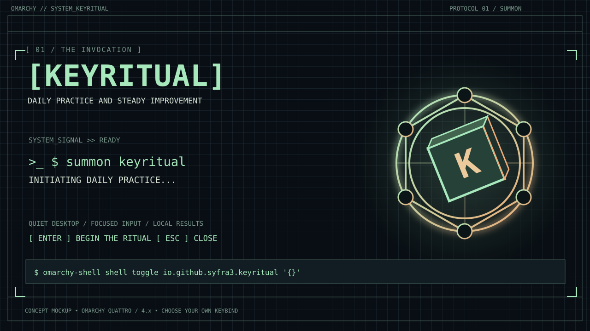
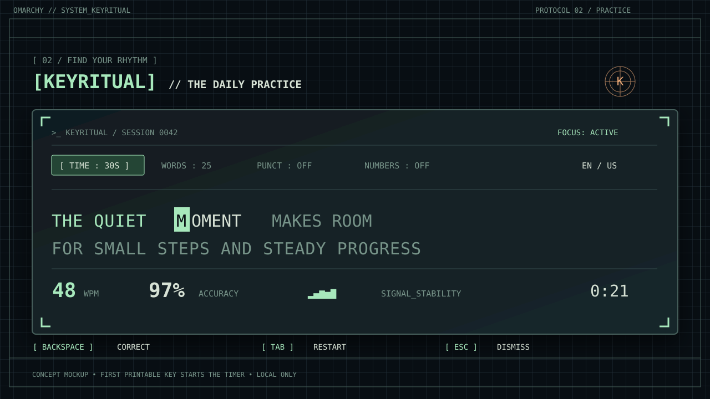
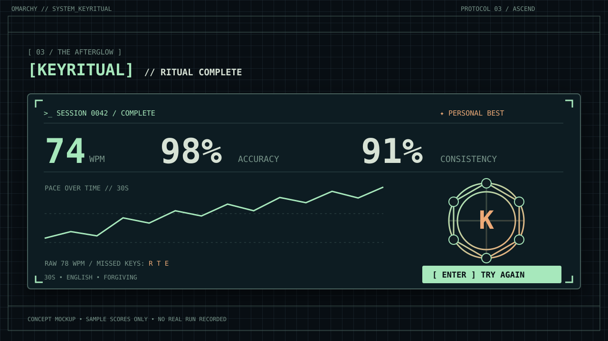

# Keyritual — Omarchy typing practice plan

**Status:** concept and visual mockups; no plugin, binary, or desktop binding has been installed.

**Target:** Omarchy Quattro / 4.x with the `omarchy-shell` plugin system. The research machine runs Omarchy 3.8.5, where `omarchy plugin` and `omarchy-shell` are not available.

**Name / proposed ID:** Keyritual / `io.github.syfra3.keyritual` (reserve this final ID when implementing the manifest). See [the visual brand system](BRAND.md) for the logomark, iconography, typography and color tokens.

## References and product direction

- [OmaType](https://github.com/jamesd7788/omatype): a good proof of concept for an Omarchy-native typing strip, theming, keyboard focus, and per-length records. It deliberately ends on the first mistake and does not support Backspace; Keyritual will offer a forgiving default and a strict option.
- [Raycast Monkeytype extension at the requested commit](https://github.com/raycast/extensions/tree/2b7f8341a1500ec36b9b3ff7b0cc1079f11d989d/extensions/monkeytype/): a launcher that opens pages on monkeytype.com. It is **not** a local typing engine. Take inspiration from the Monkeytype *experience* (modes, feedback, statistics), rather than porting its Raycast implementation or assuming Monkeytype API integration.
- [Quattro plugin guide](https://github.com/omacom/omarchy/blob/quattro/manual/32-shell-plugins.md), [shell contract](https://github.com/omacom/omarchy/blob/quattro/docs/omarchy-shell.md), and [marketplace publishing guide](https://plugins.omarchy.org/publish.html): one root-level plugin manifest and QML entry point hosted by the existing shell; no second Quickshell process.

## Proposed experience

1. Invoke via the Omarchy menu, or assign a user-selected Hyprland hotkey to `omarchy-shell shell toggle io.github.syfra3.keyritual '{}'`. No keybinding is installed or overwritten by the plugin.
2. A centered, theme-aware overlay takes keyboard focus. Choose **time** (15 / 30 / 60 s) or **words** (10 / 25 / 50), with punctuation/numbers optional. The default is 30 seconds, English, forgiving mode.
3. Type immediately. The clock begins on the first printable character; each glyph shows correct/incorrect state, the active word is highlighted, and a small live WPM/accuracy readout stays visible. Backspace corrects errors; Tab restarts; Escape closes and releases focus. Avoid capturing global keystrokes while hidden.
4. A results card shows WPM, raw WPM, accuracy, consistency, an error heatmap, a session timeline, and personal best for the selected mode. `Enter` starts another round. History and settings are local only; no Monkeytype account or network connection.
5. Optional later: code and quote modes, custom text, language packs, practice based on missed keys, export/import, and an opt-in compact bar launcher. The typing surface stays roomy even if invoked from the bar.

## Visual walkthrough

These are **design mockups**, not screenshots of a working plugin. Open the SVGs in a browser or image viewer. The supplied visual reference is interpreted as a terminal-ritual moodboard; the Keyritual vectors are original redraws rather than exact image extraction.

| Step | Image | Action |
| --- | --- | --- |
| 1. Launch | [01-launch.svg](images/01-launch.svg) | On Quattro, invoke the shell toggle command or add it to your preferred user keybinding. |
| 2. Practice | [02-practice.svg](images/02-practice.svg) | Pick a mode, type, correct with Backspace, restart with Tab, dismiss with Escape. |
| 3. Review | [03-results.svg](images/03-results.svg) | Inspect speed and accuracy, then press Enter for another attempt. |







### Brand assets

- [Ritual-key logomark](images/keyritual-mark.svg)
- [Iconography sheet](images/keyritual-icons.svg)
- [Typography and palette sheet](images/keyritual-type.svg)

## Architecture (Rust-first, Omarchy-native)

```text
Omarchy Quattro shell (already running)
  └── Keyritual.qml  [overlay: drawing, focus, key events, theme tokens]
         ⇅ newline-delimited JSON via Quickshell.Io Process stdin/stdout
      keyritual-core serve  [Rust: prompt generation, state, timing, scoring, history]
         └── $XDG_STATE_HOME/keyritual/history.json + settings.json
```

- The **Rust core** owns test state, seeded word selection, scoring, mode rules, timekeeping using a monotonic clock, and persistence. QML is a thin presentation/input adapter. Use `serde`/`serde_json` for versioned JSON-line commands (`start`, `key`, `backspace`, `tick`, `finish`, `settings`) and responses (`session`, `progress`, `result`, `error`). A session ID and sequence number prevent late responses from a previous run changing the current view.
- Run one Rust child **only while the overlay is active** (or retain it for quick repeated runs); communicate through Quickshell's `Process` stdin/stdout with line-delimited messages. Never spawn a subprocess per keystroke. On exit/crash, show a retry state and return focus cleanly. Confirm the installed Quickshell version and its `Process` APIs on the 4.x test machine before implementation.
- Use an Omarchy `overlay` entry point with `open(payloadJson)` / `close()`, `kinds: ["overlay"]`, and optional `keepLoaded: true`. Follow the built-in emoji/reminders overlay patterns for focus and theme tokens. The shell owns the surface; no changes to Omarchy source. Support high DPI, narrow displays, reduced motion, and high-contrast themes.
- Store user data under XDG state/config directories with atomic writes; bound history size and avoid retaining the exact text the user typed unless they explicitly opt in. No keylogging or cloud sync.
- Do not copy proprietary Monkeytype assets/content. Use original artwork, appropriately licensed word lists/quotes, and an explicit license for the repo and previews.

### Proposed repository layout

```text
manifest.json            # unique namespaced ID; overlay -> Keyritual.qml
Keyritual.qml            # Quickshell UI, focus, theme and process adapter
Cargo.toml               # Rust binary package in the same repo
Cargo.lock
src/main.rs              # JSONL server / CLI entry point
src/engine.rs            # deterministic test state and scoring
src/storage.rs           # settings, PBs, bounded history
assets/                  # licensed word lists, original icons
images/                  # brand marks, preview and usage illustrations
BRAND.md                 # typography, logo and iconography system
README.md                # setup, launch, shortcuts, removal, dependencies
LICENSE
preview.png              # optional marketplace preview (real screenshot later)
```

## Milestones and acceptance checks

| Milestone | Deliverable | Acceptance check |
| --- | --- | --- |
| 0. Compatibility spike | Verify Quattro shell/Quickshell versions, overlay focus, stdin/stdout bridge, theme tokens on a 4.x installation. | Toggle overlay twice; keystrokes reach it only while open; no second shell process. |
| 1. Rust engine | Timed and word-count sessions, seeded prompts, forgiving/strict modes, scoring and record persistence. | Unit/property tests cover first-key timing, errors and corrections, timer expiry, empty attempts, rapid restart, XDG storage migration. |
| 2. Native UI | Focused overlay, responsive text layout, color states, mode selector, result card. | Manual tests across two Omarchy themes, at two display scales and narrow widths; no lost keystrokes during normal typing. |
| 3. Packaging | Root manifest, reproducible Cargo build, usage docs and removal instructions. | `omarchy plugin validate .`; install from a public test repo; local binary discoverable; uninstall leaves no auto-start process. |
| 4. Release | Real preview screenshot, accessibility pass, license/asset audit, marketplace submission. | Public repository and submission issue pass marketplace validation; maintainer approval before listing. |

## Installation and publication path (after implementation, on Quattro)

The plugin installer clones QML and the manifest; it **does not execute build hooks**. Document the Rust binary as an explicit prerequisite. A practical v1 is a root Cargo package whose executable is installed into `~/.cargo/bin` via `cargo install --git https://github.com/Syfra3/keyritual.git --locked`; the plugin verifies the binary exists and displays a useful setup message if not. Then:

```bash
omarchy plugin add https://github.com/Syfra3/keyritual.git
omarchy plugin enable io.github.syfra3.keyritual
omarchy-shell shell toggle io.github.syfra3.keyritual '{}'
```

Document `omarchy plugin remove io.github.syfra3.keyritual` and `cargo uninstall keyritual-core` for removal. On the publisher's 4.x test machine, confirm the exact command and binary name. For the marketplace, publish a **public GitHub repository with one plugin, root `manifest.json`, README, license and documented dependency**; submit via [the plugin form](https://github.com/omacom/omarchy-plugin-marketplace/issues/new?template=submit-plugin.yml). Suggested category: `Productivity`; tags: `education`, `games`, `quickshell`. A polished real screenshot can be placed at root as `preview.png`. Listing depends on marketplace validation and maintainer approval.

## Open product decisions

- Confirm the proposed permanent plugin ID `io.github.syfra3.keyritual` is unused before marketplace submission.
- Default language and which additional language packs to ship first.
- Whether to support Omarchy 3.x separately as a standalone Rust app; the proposed marketplace integration targets Quattro/4.x only.

## Research links

- [OmaType README and MIT-licensed source](https://github.com/jamesd7788/omatype)
- [Raycast extension README/source at the supplied revision](https://github.com/raycast/extensions/tree/2b7f8341a1500ec36b9b3ff7b0cc1079f11d989d/extensions/monkeytype/)
- [Official Quattro shell plugin documentation](https://github.com/omacom/omarchy/blob/quattro/docs/omarchy-shell.md)
- [Marketplace development guide](https://plugins.omarchy.org/develop.html) and [publishing guide](https://plugins.omarchy.org/publish.html)
- [Marketplace repository submission requirements](https://github.com/omacom/omarchy-plugin-marketplace/blob/main/SUBMISSION.md)
