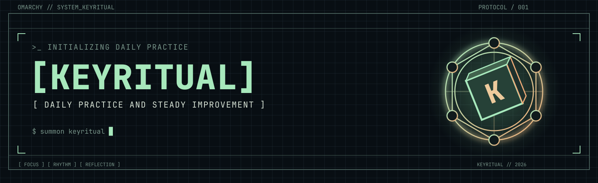
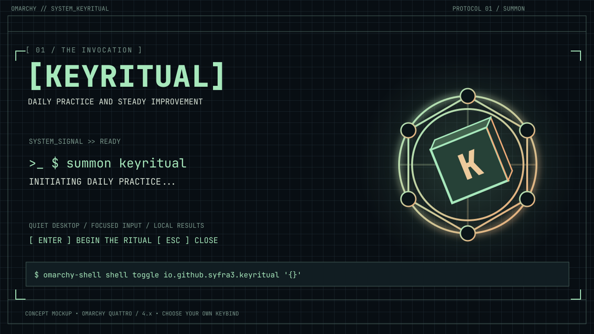
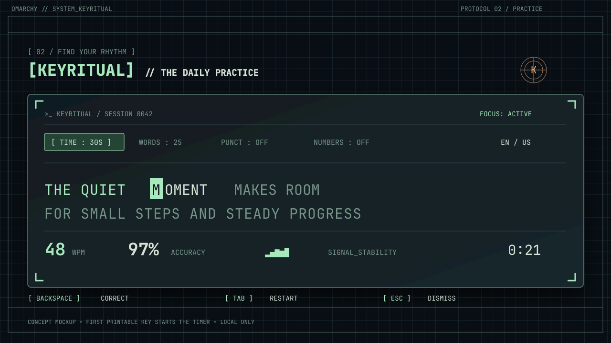
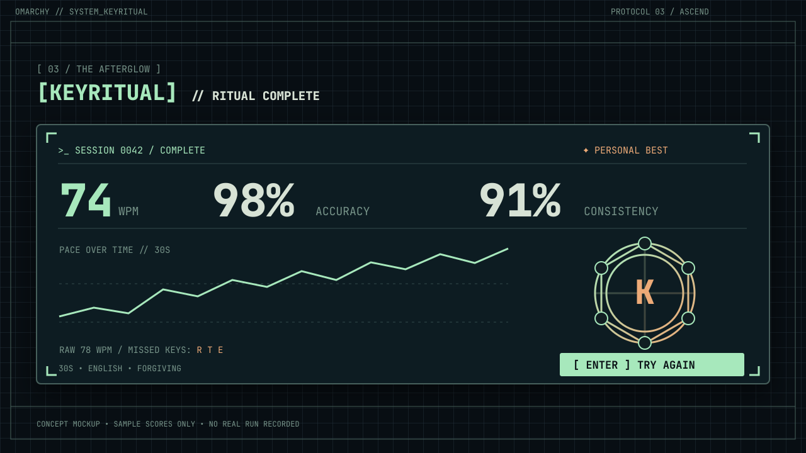
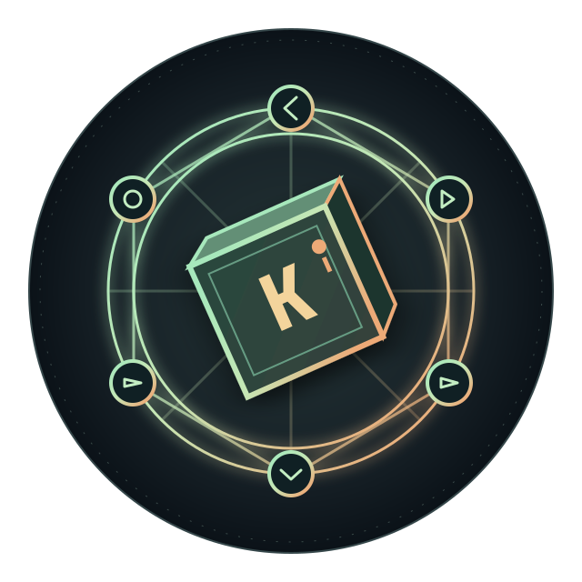
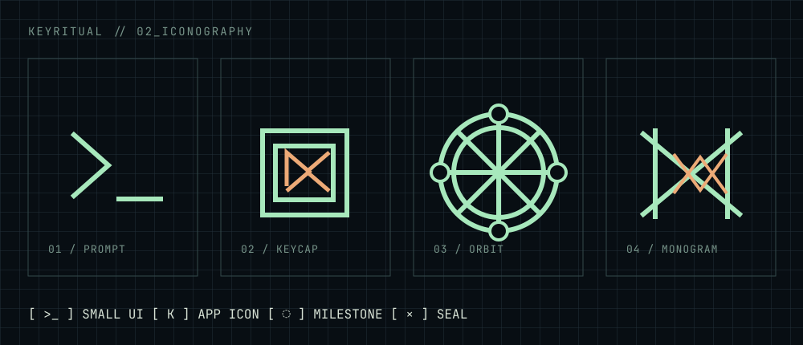
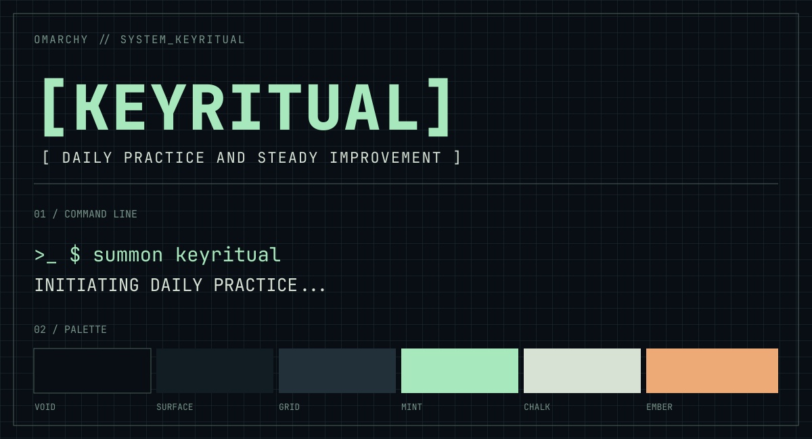

<div align="center">
  
</div>

# Keyritual

**Native typing practice for Omarchy.** Build a steady rhythm, learn from mistakes, and make daily practice feel like a small terminal ritual.

> **Status: v0.1.0-alpha.1 prerelease.** The Rust engine, Quattro overlay and local installer have been exercised on Omarchy 4.0.4. The images below are concept mockups, not current UI screenshots; visual/accessibility behavior across displays and themes remains unverified.

## Build and test

From a checkout of this repository:

```bash
make build        # optimized binary at target/release/keyritual-core
make bundle       # refresh the tracked x86_64 plugin binary after source changes
make bundle-check # confirm bundled binary matches the locked release build
make test         # formatting, Rust unit tests, Clippy
make run-engine   # JSON-lines engine on stdin/stdout; Ctrl+D to stop
```

To smoke-test `make run-engine`, enter `{"id":1,"type":"start","mode":"words","limit":10,"strict":false,"punctuation":true,"numbers":true}` and press Enter. It responds with a `state` containing the generated prompt. This is the **JSON-lines interface between the Rust engine and the overlay**, not an interactive typing UI: each further key is another JSON command such as `{"id":2,"type":"key","text":"h"}` (use the first character of your actual prompt). Blank lines are ignored; press Ctrl+D to end input. The engine can also run without Quattro, but its **desktop overlay requires Omarchy Quattro / 4.x** and `omarchy-shell`.

## Install and launch (Omarchy Quattro / 4.x only)

**One-step plugin install** (after this source is published):

```bash
omarchy plugin add https://github.com/Syfra3/keyritual.git --enable
```

The repository includes an executable `bin/keyritual-core` beside the QML plugin. No Cargo build, install hook, credentials, or privileged command runs when Omarchy clones it. Summon it with `omarchy-shell shell toggle io.github.syfra3.keyritual '{}'` (or bind that command yourself). Marketplace installation does **not** add an app-list launcher. This alpha bundle targets **x86_64 Linux with a compatible glibc**; ARM and older incompatible glibc are not supported. If the binary cannot start, the overlay shows an actionable error. The plugin stores completed history in XDG state outside its install directory.

**Manual install from a checkout** (also installs a desktop app launcher):

```bash
make install-restart # builds the local bundle and installs it, then briefly restarts the shell
make run
```

**On Omarchy 3.x:** `make install` starts Omarchy's official interactive `omarchy upgrade to quattro` command. This is a one-way **operating-system migration**, not a Keyritual package installation. The official upgrader asks for confirmation and handles its own system changes; follow its reboot instructions. **After the upgrade and reboot, run `make install` again**, then `make run`. The Makefile never bypasses the confirmation, runs the upgrade in a non-interactive session, or tries to install a plugin in the still-running 3.x desktop. `make build`, `make test`, and `make run-engine` do not require the upgrade.

**On Quattro:** `make install` refreshes the bundled Rust binary, checks for an existing Keyritual plugin directory, installs a separate Cargo binary for the optional app launcher, validates and installs the **current local** manifest/QML/binary/seal under `~/.config/omarchy/plugins/io.github.syfra3.keyritual/`, enables the plugin, and adds a user-owned `.desktop` entry and icon. It updates only recognized Keyritual plugin installations, retaining the previous directory as a backup; it refuses unknown or modified plugin directories. The running shell may keep an older QML component in memory after installation. If the UI still looks old, run `omarchy restart shell`, or use `make install-restart` to install and then restart the shell explicitly. Restarting briefly interrupts the bar and overlays; ordinary `make install` does not restart them. Omarchy's Git-based plugin installer does not build Rust binaries or run installation hooks; it uses the executable already bundled in this repository.

After the manual install, you can launch from the **searchable app list** as “Keyritual” or use `make run`. The desktop entry uses the Cargo binary's absolute path even if your desktop session's `PATH` excludes `~/.cargo/bin`.

For an **optional keybinding**, assign a free shortcut to `keyritual-core launch` in your user-owned `~/.config/hypr/bindings.lua`. For example, on Quattro:

```lua
o.bind("SUPER + SHIFT + K", "Keyritual", os.getenv("HOME") .. "/.cargo/bin/keyritual-core launch")
```

Check that the chord is unused before adding it. This repository never changes your bindings automatically. The same `launch` command toggles the overlay, so the app launcher and hotkey lead to the same experience.

**Controls:** Click the mode, limit, strict, punctuation or numbers labels to change settings. Click **Commands** for letter controls (`m` mode, `t` limit, `s` strict, `p` punctuation, `n` numbers, `r` restart, `q` close); click **Typing** to return. Tab restarts; Backspace corrects; Enter repeats a completed run; clicking outside closes. Ctrl+M may toggle command mode where the shell passes that shortcut through; prefer the clickable controls. Timing starts on the first printable key. Strict mode ends at the first mistake.

To remove a marketplace install, use `omarchy plugin remove io.github.syfra3.keyritual` (it does not remove history). For a manual install, disable the plugin with `omarchy plugin disable io.github.syfra3.keyritual`, remove its user-owned directory under `~/.config/omarchy/plugins/`, then run `cargo uninstall keyritual-core` and remove the desktop entry and icon under `~/.local/share/applications/io.github.syfra3.keyritual.desktop` and `~/.local/share/icons/hicolor/512x512/apps/keyritual.png`. Your local record file is at `${XDG_STATE_HOME:-$HOME/.local/state}/keyritual/history.json`; delete it only if you also want to discard your history.

## The ritual

1. **Summon** a focused, theme-aware typing surface from Omarchy.
2. **Practice** in timed or word-count mode with punctuation and number switches, immediate character feedback, corrections, and an unobtrusive live score.
3. **Reflect** on WPM, accuracy, raw speed, real per-second pace/consistency, local personal bests, previous-run deltas and prior-five-session averages. **History** shows the 20 most recent completed sessions with local dates and errors when available. **Share Result** previews only the current rounded score, mode and limit; clicking **Open X compose** opens an external browser with that text. It never posts automatically. Older stored sessions show unavailable errors rather than invented zeros. Missed-key coaching remains on the roadmap.

| Summon | Practice | Reflect |
| :---: | :---: | :---: |
|  |  |  |

## Brand kit

The visual language pairs a dark graph-paper grid and bracketed terminal typography with a mint-and-ember **ritual key**. The logo and icons are original vector interpretations of the supplied visual reference; they are not an exact trace. The current alpha uses the supplied void/surface/mint/chalk palette; theme adaptation is future work.

| Logomark | Iconography | Typography and palette |
| :---: | :---: | :---: |
|  |  |  |

Editable SVGs and PNG previews live in [`images/`](images/). See [BRAND.md](BRAND.md) for tokens, typography, icon usage, and accessibility notes.

## Implementation

- **Rust core:** prompt generation, monotonic timing, deterministic session state, scoring, strict and forgiving modes, and bounded local history under XDG state. Test with `cargo test`.
- **Omarchy shell overlay:** `Keyritual.qml` receives focus and key events, uses a compact palette-matched popup, and talks to one Rust process through newline-delimited JSON. There is no subprocess per keystroke.
- **Local by default:** no Monkeytype account or global keystroke capture; only an explicit Open X compose click opens an external URL with rounded score/mode/limit.
- **Distribution:** one Quattro plugin manifest at the repo root, the tracked x86_64 engine in `bin/`, and an optional XDG app launcher from manual installation. The installer validates its staged plugin on Omarchy 4.x; no marketplace listing is included in this release.

The feature sequence and remaining acceptance checks are in [PLAN.md](PLAN.md). The plugin ID is `io.github.syfra3.keyritual`. This early version has no language packs or missed-key coaching yet. Finished-session history is local, bounded to 200 runs, with the newest 20 shown in the History menu. Real pace/error history and X compose need a live UI/privacy check before public release.

For marketplace submission metadata, compatibility and remaining checks, see [docs/marketplace.md](docs/marketplace.md). A submitted issue is not an approved marketplace listing.

## Inspiration and references

- [Monkeytype](https://monkeytype.com/) is the **primary product inspiration**: a fast, focused typing test with configurable modes, feedback, and progress. Keyritual is an original implementation for Omarchy, not a port or a Monkeytype client.
- [OmaType](https://github.com/jamesd7788/omatype) is an **Omarchy integration reference** for shell focus, themes, and keyboard handling, not the product model.
- [Raycast's Monkeytype extension](https://github.com/raycast/extensions/tree/2b7f8341a1500ec36b9b3ff7b0cc1079f11d989d/extensions/monkeytype/) opens Monkeytype web pages; it is not a local typing engine.
- [Omarchy Quattro shell plugin guide](https://github.com/omacom/omarchy/blob/quattro/manual/32-shell-plugins.md) and [plugin marketplace](https://plugins.omarchy.org/).

## License

[MIT](LICENSE) for Keyritual's code, documentation and included artwork (including the supplied seal, published with the provider's permission). Third-party projects linked above retain their own licenses.
